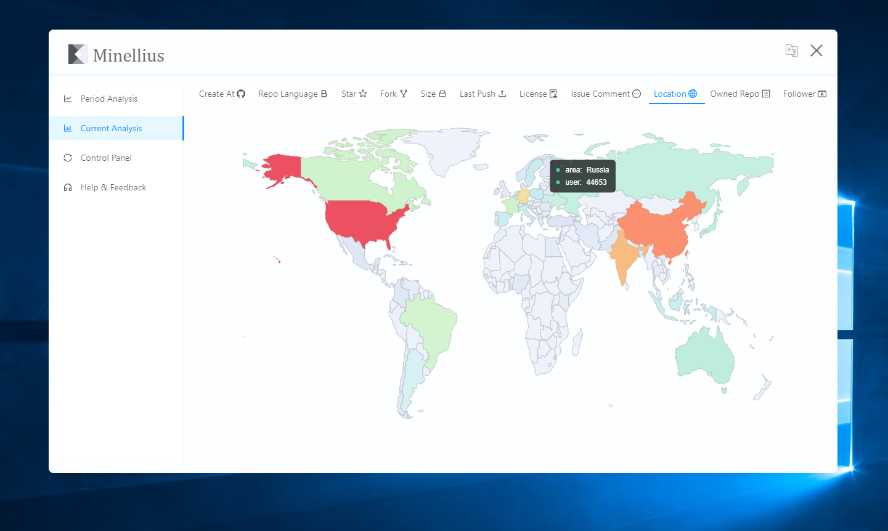
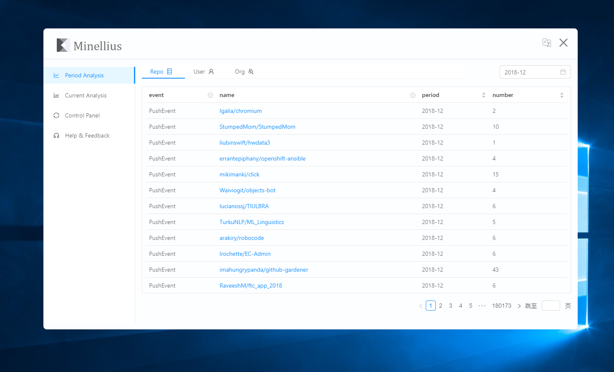

<h1 align="center">
  <br>
    
  <br>
  Minellius
  <br>
</h1>
<p align="center">
<b>
A experimental github data analysis solution<br>
Group project of COMP-3002, 2018 fall, HITsz.
</b>
</p>

<p align="center">


  
  
  
</p>

## 👀 Overview

<b>Minellius, a experimental github data analysis solution</b>, which designed to combine data collection, persistence, integration, analysis, visualization, real-time monitoring, trend tracking, originating from a group project of COMP-3002, 2018 fall, HITsz.

Minellius aims to help users understand the history, current, trend, ups and downs of github and even the open source world, enhance the sense of the times and the cultural aesthetics of the community; adjust the path of developers' learning and self-improvement to better integrate and participate in the development of community resources and culture.

## 📑 Table of Contents

<ul>
<li><a href="#overview">&#x1F440; Overview</a></li>
<li><a href="#table-of-contents">&#x1F4D1; Table of Contents</a></li>
<li><a href="#how-it-works">&#x1F528; How It Works</a></li>
<li><a href="#%EF%B8%8F-features">&#x2B50;&#xFE0F; Features</a></li>
<li><a href="#example-snapshot">&#x1F453; Example Snapshot</a></li>
<li><a href="#installation-usage">&#x1F527; Installation &amp; Usage</a>
</li>
<li><a href="#platform-support">&#x1F4BB; Platform Support</a></li>
<li><a href="#language-support">&#x1F30F; Language Support</a></li>
<li><a href="#acknowledgement">&#x1F44D; Acknowledgement</a></li>
<li><a href="#source-code-reference-main">&#x1F449; Source Code Reference (Main)</a></li>
<li><a href="#%EF%B8%8F-faq">&#x2754;&#xFE0F; FAQ</a></li>
<li><a href="#docs">&#x1F4D9; Docs</a></li>
<li><a href="#%EF%B8%8F-resource-reference">&#x1F3F7;&#xFE0F; Resource &amp; Reference</a></li>
<li><a href="#contributors">&#x1F606; Contributors</a></li>
<li><a href="#license">&#x1F4DC; License</a></li>
</ul>

## 🔨 How It Works

Crawl data from [Gharchive](https://www.gharchive.org/) and [Github Api](https://api.github.com/), then Aggregate, store, and visualize them.

## ⭐️ Features

1. Data Visualization with Charts and Tables
2. Streaming Crawling and Analysis, Minimal Processing Space Requirement
3. Basic User System with Bearer JWT Auth and Github Oauth Auth
4. Secure Store and Transmission
5. Continuous Integration
6. Auto Recovery and Email Alert
7. Autogen Documents
8. I18n (Multi-language)
9. Multi-platform
10. Antd Design

## 👓 Example Snapshot

**Current Snapshot**



**Period Snapshot**



## 🔧 Installation & Usage

### Client

**From Binary (Recommended)**

Please see [release page](https://github.com/lonelyhentai/minellius/releases), and download the latest version for your platform. By default, we provide `windows version (portable exe)` and `linux version (AppImage)`. And because of project deadline limitation, we only provide `1280x720px` client.

**From Source Code (Not Recommended)**

1. First, enter into `client` directory and install the dependencies.Sure, you need [node.js](https://nodejs.org/en/) environment and **avaiable network (for china users)**.

```sh
cd client
npm install
```

2. Then build client for your platform.

```sh
# auto select suitable platform (recommended)
npm run electron:local
# or manually select platform
npm run electron:windows
npm run electron:linux
npm run electron:mac # no test
```

3. You can find output in `client/release` directory, then copy and use it.

**From Source Code To Dev (Only to developers)**

Again, install then start hot-reload dev server on http://localhost:4200 with electron. If you need chrome devtools, edit `client/src/main.ts`, set `devTools` to be `true` and  restart it.

```sh
cd client
npm install
npm run start
```

### Server

> **Important: Target server of our client has been set as our server, if you need deploy your server, you should edit it in the client source and rebuild the client as well.**

**With Docker-compose (Recommended)**

0. Sure, you need [docker](https://docs.docker.com/install/) and [docker-compose](https://docs.docker.com/compose/install/) environment.

1. First, copy `docker-compose.sample.yaml` to `docker-compose.yaml` and edit environment variables in it or export them to your current shell.

2. Copy `monitor/.docker-alertd.sample.yaml` to `monitor/.docker-alertd.yaml`. Edit alert email information in it.

> 3. Optional: We recommend postgresql database to deploy our service, if you use it, you can create a new database and import init tables from `deploy/database/postgresql/minellius.sql`. Then you can skip later database import.  

> 4. Optional: Because of huge amount of data, our 100GB database has no more space, so we cancel its auto start function in docker mode. To crawl period data, you should manually edit `crawler/Dockfile` and add `crawler/src/go.py` to the cmd field. For new fishs to docker or needing more information, see [Dockerfile Reference](https://docs.docker.com/engine/reference/builder/).

5. Then easily build and start.

```sh
docker-compose build
docker-compose up
```

6. Waiting `minellius-server` container init the database tables, you need import init insert data from `deploy/database/common`. If you use postgresql, you can easily import all (see step 3) `.sql` files, else you need manually import one by one now.

7. If you need https and http2.0, install and start a [nginx web server](http://nginx.org/), copy our configuration file to its vhost directory, editting to fit yourself. And if you need free https cert, visit [Let's encrypt](https://letsencrypt.org/).

**Manually Deploy (Not Recommended)**

> **Important: if you insist on manually deployment, you will lose the automatic email alert, and the automatic restart of the crawler will depends all on the third-party monitoring tool you use.**

0. export need enviroment variables, see in `docker-compose.sample.yaml` environments fields.

> 1. Optional: We recommend postgresql database to deploy our service, if you use it, you can create a new database and import init tables from `deploy/database/postgresql/minellius.sql`. Then you can skip later database import.    

2. `minellius-server`, ensuring you have [node.js](https://nodejs.org/en/) installed.

```sh
cd server
npm install
npm run start:prod
# or for developement use
npm run start:dev
```

4. database import - waiting `minellius-server` container init the database tables, you need import init insert data from `deploy/database/common`. If you use postgresql, you can easily import all (see step 3) `.sql` files, else you need manually import one by one now.

5. `minellius-crawler`, ensuring you have [basic python 3.6+ tools](https://www.python.org/) installed. And you need daemon tools to help you run them as services. Without docker, we recommend `pm2`.

```sh
cd crawler/
pip install -r requirements.txt
cd src
python current.py
# if you need period
python go.py
```

6. If you need https and http2.0, install and start a [nginx web server](http://nginx.org/), copy our configuration file to its vhost directory, editting to fit yourself. And if you need free https cert, visit [Let's encrypt](https://letsencrypt.org/).

## 💻 Platform Support
| Windows | Linux | Mac |
| :---------: | :---------: | :---------: |
| 10+<br>(7+ possible) | 3.20+ With AppImage | Need manually build, no test now |

## 🌏 Language Support

1. English
2. 简体中文

&nbsp;&nbsp;&nbsp;More languages are coming soon...

## 👍 Acknowledgement

<!-- ALL-Acknowledgement-LIST:START - Do not remove or modify this section -->
<!-- prettier-ignore -->
| [<br /><sub><b>Electron</b></sub>](https://electronjs.org)<br />        | [<br /><sub><b>Angular</b></sub>](https://angular.io)<br /> | [<br /><sub><b>NG-Zorro</b></sub>](https://ng.ant.design)<br />          |  [<br /><sub><b>Nestjs</b></sub>](https://nestjs.com)<br />  |  [<br /><sub><b>Docker</b></sub>](https://www.docker.com/)<br /> |  
| :-----------------------------------------------------------------------------------------------------------------------------------------------------------------: | :-----------------------------------------------------------------------------------------------------------------------------------------------------------------------: | :-------------------------------------------------------------------------------------------------------------------------------------------------------------------: | :-------------------------------------------------------------------------------------------------------------------------------------------------------------: | :------------------------------------------------------------------------------------------------------------------------------------------------------------: | 
<!-- ALL-Acknowledgement-LIST:END -->

## 👉 Source Code Reference (Main)

1. client
    - infra - angular + electron + ant zorro
    - components - `client/src/app/**/*.component.ts`
    - providers & services - `client/src/app/providers/*.service.ts`
    - dtos - `client/src/app/dtos/*.dto.ts`
    - functools - `client/src/app/functools/*.functool.ts` & innerCode
    - directives - `client/src/app/directives/*.directive.ts`
    - interfaces - `client/src/app/interfaces/*.interface.ts` & innerCode
    - animations - `client/src/app/animations/*.animations.ts`
    - style - `client/src/app/**/*.scss` & innerCode
    - module - `client/src/app/**/*.module.ts`
    - router - `client/src/app/app-routing.module.ts` & routeService & routerService
    - guards - `client/src/app/guards/auth.guard.ts`
    - current - `client/src/app/components/current*.*` & `client/src/app/providers/current.service.ts`
    - period - `client/src/app/components/period*.*` & `client/src/app/providers/period.service.ts`
    - user - `client/src/app/componets/log*.*` & `client/src/app/providers/user.service.ts` & `client/src/app/components/control.component.ts`
    - helper - `client/src/app/components/helper`
    - i18n - `TranslateService` & `src/app/providers/custom-translate.service.ts` & `src/assets/i18n/*.json`
    - introduction - `src/app/components/{home,video}.components.*`
    - img & video & geo - `src/assets`
    - test - `**/*.spec.ts`
    - bootstrap - `main{.ts,.js}` | `index.html`
    - config 
    - ...
2. server
    - nodejs + nest + native python + postgresql
    - auth - `server/src/auth/**/*` & `server/src/role/**/*`
    - user & group & permission ... - `server/src/role/**/*`
    - data - `server/src/data/**/*`
    - database - `server/src/database/**/*` & `deploy/database/*` & `**/*.entities.ts` & `TypeOrmModule` & `**/*.service.ts`
    - config - `**/*-config.interface.ts` && `**/*-config{.*}` && environments variables & `**/*{.json,.yaml,.yml}` ...
    - https & http2.0 - `minellius.nginx.sample.conf` + nginx proxy pass
    - monitor - `monitor/.docker-alertd.yaml` + docker-alertd + `docker-compose.yaml` + docker-compose + docker + pm2.json + pm2
    - cralwer - `crawler/src/*.py`
    - document - `server/src/**/*.dto.ts` & `server/src/**/*.controller.ts` & swagger
    - controller - `server/src/**/*.controller.ts`
    - service - `server/src/**/*.service.ts`
    - module - `server/src/**/*.module.ts`
    - ...


## ❔️ FAQ

1. The range of the period event data you provide?
  > We provide data from 2015.01.01 to 2018.12.26. But since we don't have a low-cost way to store such a large amount of data, after the end of the semester, we will only provide the last month of data as the basic demo of our application service. And we will provide download link for that data, you can find them in resource section.

## 📙 Docs

* [Server Api Document](https://minellius.evernightfireworks.com/document)
* [Initiation Document (Chinese Assignment)](./doc/initiation_document.md)
* [Software_Requirements_Specification.pdf (Chinese Assignment)](./doc/Software_Requirements_Specification.pdf)

## 🏷️ Resource & Reference

1. [Course Information](http://liaoqing.me/comp3002.html)
2. [Zipped Sql File from 2015.01.01 to 2018.01.26 Download](https://pan.baidu.com/s/17WEgYuZ4G_X6Ofig3c-alg)
3. [Promotional Video (Short Version)](https://pan.baidu.com/s/12Gwn7sP0eknQO9S_LTAAxA)
4. [Promotional Video (Full Version)](https://pan.baidu.com/s/1OakbX0BhmJC7Dv-BEC7icg)
5. [Presentation Slides (Chinese Assignment)](https://pan.baidu.com/s/13AlfCgq6PM63Oo_okMUcSg)

## 😆 Contributors

<!-- ALL-CONTRIBUTORS-LIST:START - Do not remove or modify this section -->
<!-- prettier-ignore -->
| [<br /><sub><b>Zhou Yeheng</b></sub>](https://github.com/lonelyhentai)<br />        | [<br /><sub><b>Cui Tianyu</b></sub>](https://github.com/HITFZ-cty)<br /> | [<br /><sub><b>Cao Weihan</b></sub>](https://github.com/Cwhdly)<br />          |  [<br /><sub><b>Lin jintao</b></sub>](https://github.com/dreamerlin)<br />  |  [<br /><sub><b>Fang An</b></sub>](https://github.com/anhit)<br /> |  
| :-----------------------------------------------------------------------------------------------------------------------------------------------------------------: | :-----------------------------------------------------------------------------------------------------------------------------------------------------------------------: | :-------------------------------------------------------------------------------------------------------------------------------------------------------------------: | :-------------------------------------------------------------------------------------------------------------------------------------------------------------: | :------------------------------------------------------------------------------------------------------------------------------------------------------------: | 
<!-- ALL-CONTRIBUTORS-LIST:END -->

## 📜 License
This software is licensed under the [MIT](./LICENSE.txt) 

```text
MIT License

Copyright (c) 2018 Zhou Yeheng, Cui Tianyu, Cao Weihan, Lin Jintao, Fang An

Permission is hereby granted, free of charge, to any person obtaining a copy
of this software and associated documentation files (the "Software"), to deal
in the Software without restriction, including without limitation the rights
to use, copy, modify, merge, publish, distribute, sublicense, and/or sell
copies of the Software, and to permit persons to whom the Software is
furnished to do so, subject to the following conditions:

The above copyright notice and this permission notice shall be included in all
copies or substantial portions of the Software.

THE SOFTWARE IS PROVIDED "AS IS", WITHOUT WARRANTY OF ANY KIND, EXPRESS OR
IMPLIED, INCLUDING BUT NOT LIMITED TO THE WARRANTIES OF MERCHANTABILITY,
FITNESS FOR A PARTICULAR PURPOSE AND NONINFRINGEMENT. IN NO EVENT SHALL THE
AUTHORS OR COPYRIGHT HOLDERS BE LIABLE FOR ANY CLAIM, DAMAGES OR OTHER
LIABILITY, WHETHER IN AN ACTION OF CONTRACT, TORT OR OTHERWISE, ARISING FROM,
OUT OF OR IN CONNECTION WITH THE SOFTWARE OR THE USE OR OTHER DEALINGS IN THE
SOFTWARE.
```